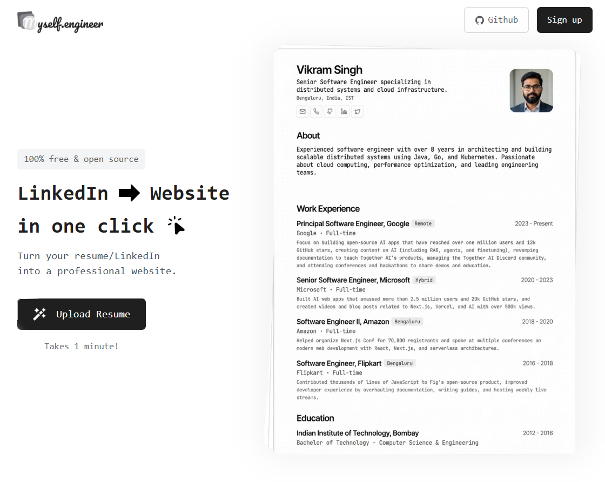

<a href="https://www.myself.engineer">
  
  <h1 align="center">Myself.engineer</h1>
</a>

<p align="center">
  An open source AI-powered personal site builder.<br/>
  <strong>Turn your resume into a live website in seconds.</strong>
</p>

<p align="center">
  <a href="#how-it-works">How It Works</a> •
  <a href="#architecture-deep-dive">Architecture</a> •
  <a href="#tech-stack">Tech Stack</a> •
  <a href="#running-locally">Run Locally</a>
</p>

---

## How It Works

This project transforms a PDF resume into a professional personal website using AI. Here's the complete user journey:

```
┌─────────────────────────────────────────────────────────────────────────────┐
│                           THE USER JOURNEY                                   │
└─────────────────────────────────────────────────────────────────────────────┘

    ┌──────────────┐         ┌──────────────┐         ┌──────────────┐
    │   LANDING    │         │    SIGN IN   │         │    UPLOAD    │
    │    PAGE      │ ──────► │   (Clerk)    │ ──────► │     PDF      │
    │      /       │         │              │         │   /upload    │
    └──────────────┘         └──────────────┘         └──────┬───────┘
                                                             │
                                                             ▼
    ┌──────────────┐         ┌──────────────┐         ┌──────────────┐
    │  YOUR LIVE   │         │   PUBLISH    │         │  AI PARSES   │
    │   WEBSITE    │ ◄────── │   OR EDIT    │ ◄────── │    RESUME    │
    │ /your-name   │         │   /preview   │         │   (Gemini)   │
    └──────────────┘         └──────────────┘         └──────────────┘
```

### Step-by-Step Breakdown

| Step | What Happens | Where |
|------|--------------|-------|
| **1. Landing** | User visits homepage, sees "Upload Resume" CTA | `app/page.tsx` |
| **2. Auth** | Clerk handles sign-up/sign-in | `middleware.ts` |
| **3. Upload** | PDF dragged/dropped, uploaded to AWS S3 | `app/(private)/upload/` |
| **4. Process** | Gemini AI extracts resume data into structured JSON | `app/(private)/preview/` |
| **5. Preview** | User sees parsed resume, can toggle Edit mode | `components/resume/` |
| **6. Publish** | Toggle "Live" to make site public | `hooks/useUserActions.tsx` |
| **7. Share** | Public profile available at `/{username}` | `app/[username]/page.tsx` |

---

## Architecture Deep Dive

### The Data Flow

```
┌─────────────────────────────────────────────────────────────────────────────┐
│                              DATA FLOW                                       │
└─────────────────────────────────────────────────────────────────────────────┘

  USER UPLOADS PDF
        │
        ▼
  ┌─────────────────┐
  │   AWS S3        │  ◄──── PDF file stored here
  │   (Storage)     │
  └────────┬────────┘
           │
           ▼
  ┌─────────────────┐
  │   pdf-ts        │  ◄──── Extract raw text from PDF
  │   (Parser)      │
  └────────┬────────┘
           │
           ▼
  ┌─────────────────┐
  │  Gemini 2.5     │  ◄──── AI parses text into structured JSON
  │  Flash Lite     │        (name, skills, experience, education)
  └────────┬────────┘
           │
           ▼
  ┌─────────────────┐
  │  Upstash Redis  │  ◄──── Stores: resume data, username mappings
  │   (Database)    │
  └────────┬────────┘
           │
           ▼
  ┌─────────────────┐
  │   Public Site   │  ◄──── yourname.myself.engineer
  │   (Next.js)     │
  └─────────────────┘
```

### Database Structure (Redis)

```
┌─────────────────────────────────────────────────────────────────────────────┐
│                            REDIS KEYS                                        │
└─────────────────────────────────────────────────────────────────────────────┘

  resume:{userId}
  └── {
        status: 'live' | 'draft',
        file: { name, url, size, bucket, key },
        fileContent: "extracted PDF text...",
        resumeData: {
          header: { name, shortAbout, contacts, skills },
          summary: "...",
          workExperience: [...],
          education: [...]
        }
      }

  user:id:{userId}     ──►  username    (get username from user ID)
  user:name:{username} ──►  userId      (get user ID from username)
```

### API Routes

| Endpoint | Method | Purpose |
|----------|--------|---------|
| `/api/resume` | `GET` | Fetch user's resume data |
| `/api/resume` | `POST` | Store/update resume data |
| `/api/username` | `GET` | Get current user's username |
| `/api/username` | `POST` | Update username |
| `/api/check-username` | `POST` | Check if username is available |
| `/api/s3-upload` | `POST` | Upload PDF to S3 |

---

## Project Structure

```
myself.engineer/
├── app/
│   ├── page.tsx                    # Landing page
│   ├── [username]/
│   │   ├── page.tsx                # Public profile page
│   │   └── og/route.tsx            # OpenGraph image generator
│   ├── (private)/
│   │   ├── upload/                 # PDF upload page
│   │   └── preview/                # Resume preview & edit page
│   └── api/
│       ├── resume/route.ts         # Resume CRUD
│       ├── username/route.ts       # Username management
│       ├── check-username/route.ts # Username availability
│       └── s3-upload/route.ts      # File upload
│
├── components/
│   ├── resume/
│   │   ├── FullResume.tsx          # Main resume display
│   │   ├── Header.tsx              # Name, contacts, skills
│   │   ├── Summary.tsx             # Professional summary
│   │   ├── WorkExperience.tsx      # Job history
│   │   └── Education.tsx           # Education section
│   ├── resume/editing/             # Edit mode components
│   │   ├── EditResume.tsx          # Main edit form
│   │   ├── WorkExperienceField.tsx # Job editor
│   │   └── EducationField.tsx      # Education editor
│   └── ui/                         # shadcn/ui components
│
├── lib/
│   ├── resume.ts                   # Zod schemas for resume data
│   ├── routes.ts                   # Protected routes config
│   ├── server/
│   │   ├── redis.ts                # Redis client
│   │   ├── redisActions.ts         # Database operations
│   │   ├── scrapePdfContent.ts     # PDF text extraction
│   │   └── ai/
│   │       ├── generateResumeObject.ts  # AI parsing logic
│   │       └── isFileContentBad.ts      # Content safety check
│
├── hooks/
│   └── useUserActions.tsx          # All React Query mutations/queries
│
└── middleware.ts                   # Clerk auth middleware
```

---

## Tech Stack

| Category | Technology |
|----------|------------|
| **Framework** | Next.js 16 (App Router) |
| **Language** | TypeScript |
| **Frontend** | React 19, Tailwind CSS |
| **UI Components** | shadcn/ui + Radix UI |
| **State Management** | TanStack Query (React Query) |
| **Authentication** | Clerk |
| **Database** | Upstash Redis |
| **File Storage** | AWS S3 |
| **AI/LLM** | Google Gemini 2.5 Flash Lite |
| **PDF Processing** | pdf-ts |
| **Animations** | Framer Motion |
| **Form Validation** | React Hook Form + Zod |

---

## The AI Magic

The core AI processing happens in `lib/server/ai/generateResumeObject.ts`:

```
┌─────────────────────────────────────────────────────────────────────────────┐
│                         AI PROCESSING PIPELINE                               │
└─────────────────────────────────────────────────────────────────────────────┘

  INPUT: Raw text extracted from PDF
         "John Doe | Software Engineer | john@email.com | 5 years experience..."

                                    │
                                    ▼

  PROMPT: "Parse this resume into JSON following this schema:
           - header (name, contacts, skills - max 10)
           - summary
           - workExperience (company, title, dates, description)
           - education (school, degree, years)"

                                    │
                                    ▼

  MODEL: Gemini 2.5 Flash Lite
         - Fast inference
         - Structured JSON output
         - Intelligent extraction

                                    │
                                    ▼

  OUTPUT: {
            header: {
              name: "John Doe",
              shortAbout: "Software Engineer",
              contacts: { email: "john@email.com", ... },
              skills: ["JavaScript", "React", "Node.js", ...]
            },
            summary: "Experienced software engineer...",
            workExperience: [...],
            education: [...]
          }
```

---

## Resume Data Schema

The core data structure (defined in `lib/resume.ts`):

```typescript
ResumeData {
  header: {
    name: string
    shortAbout: string
    location?: string
    contacts: {
      website?: string
      email?: string
      phone?: string
      twitter?: string
      linkedin?: string
      github?: string
    }
    skills: string[]  // max 10
  }
  summary: string
  workExperience: [{
    company: string
    link: string
    location: string
    contract: string
    title: string
    start: "YYYY-MM-DD"
    end?: "YYYY-MM-DD"  // null if current
    description: string
  }]
  education: [{
    school: string
    degree: string
    start: number  // year
    end: number    // year
  }]
}
```

---

## Running Locally

### Prerequisites

- Node.js 18+
- pnpm (recommended) or npm
- AWS account (for S3)
- Clerk account (for auth)
- Upstash account (for Redis)
- Google AI Studio account (for Gemini API)

### Step 1: Clone the Repository

```bash
git clone https://github.com/paramjeetn/myself.engineer.git
cd myself.engineer
```

### Step 2: Install Dependencies

```bash
pnpm install
```

### Step 3: Set Up Environment Variables

Create a `.env` file in the root directory:

```env
# AWS S3 - For storing uploaded PDFs
S3_UPLOAD_REGION=ap-south-1
S3_UPLOAD_KEY=your-aws-access-key-id
S3_UPLOAD_SECRET=your-aws-secret-access-key
S3_UPLOAD_BUCKET=your-bucket-name

# Upstash Redis - For database
UPSTASH_REDIS_REST_URL=https://your-redis-instance.upstash.io
UPSTASH_REDIS_REST_TOKEN=your-upstash-token

# Google Gemini - For AI processing
GEMINI_API_KEY=your-gemini-api-key

# Clerk - For authentication
NEXT_PUBLIC_CLERK_PUBLISHABLE_KEY=pk_test_xxxxx
CLERK_SECRET_KEY=sk_test_xxxxx
```

### Step 4: Get Your API Keys

<details>
<summary><strong>AWS S3 Setup</strong></summary>

1. Go to [AWS Console](https://aws.amazon.com/console/)
2. Create an S3 bucket with public read access for uploaded files
3. Create an IAM user with S3 permissions
4. Generate access keys and add to `.env`

**Bucket Policy (allow public read):**
```json
{
  "Version": "2012-10-17",
  "Statement": [
    {
      "Sid": "PublicReadGetObject",
      "Effect": "Allow",
      "Principal": "*",
      "Action": "s3:GetObject",
      "Resource": "arn:aws:s3:::your-bucket-name/*"
    }
  ]
}
```

**CORS Configuration:**
```json
[
  {
    "AllowedHeaders": ["*"],
    "AllowedMethods": ["GET", "PUT", "POST"],
    "AllowedOrigins": ["*"],
    "ExposeHeaders": []
  }
]
```
</details>

<details>
<summary><strong>Upstash Redis Setup</strong></summary>

1. Go to [Upstash Console](https://console.upstash.com/)
2. Create a new Redis database
3. Copy the REST URL and REST Token to `.env`
</details>

<details>
<summary><strong>Google Gemini Setup</strong></summary>

1. Go to [Google AI Studio](https://aistudio.google.com/)
2. Click "Get API Key"
3. Create a new API key and add to `.env`
</details>

<details>
<summary><strong>Clerk Setup</strong></summary>

1. Go to [Clerk Dashboard](https://dashboard.clerk.com/)
2. Create a new application
3. Copy the Publishable Key and Secret Key to `.env`
4. Configure sign-in options (Email, Google, GitHub, etc.)
</details>

### Step 5: Run the Development Server

```bash
pnpm dev
```

Open [http://localhost:3000](http://localhost:3000) in your browser.

### Step 6: Test the Flow

1. Click "Upload Resume"
2. Sign in with Clerk
3. Upload a PDF resume
4. Watch the AI parse your resume
5. Edit any sections as needed
6. Click "Publish" to make your site live
7. Share your URL: `localhost:3000/your-username`

---

## Available Scripts

```bash
# Development
pnpm dev          # Start dev server at localhost:3000

# Production
pnpm build        # Build for production
pnpm start        # Start production server

# Code Quality
pnpm lint         # Run ESLint
```

---

## Key Files to Understand

| File | What It Does |
|------|--------------|
| `lib/resume.ts` | Defines the Zod schema for all resume data |
| `lib/server/ai/generateResumeObject.ts` | Core AI logic - sends PDF text to Gemini |
| `lib/server/redisActions.ts` | All database operations (CRUD) |
| `hooks/useUserActions.tsx` | React Query hooks for API calls |
| `app/(private)/preview/client.tsx` | Main preview page with edit functionality |
| `components/resume/FullResume.tsx` | Renders the complete resume display |
| `middleware.ts` | Protects routes with Clerk auth |

---

## Troubleshooting

**"Cannot upload PDF"**
- Check S3 credentials and bucket permissions
- Ensure CORS is configured on the bucket

**"AI parsing failed"**
- Verify Gemini API key is valid
- Check if PDF has extractable text (not scanned images)

**"Username not available"**
- Usernames must be unique
- Max 40 characters, alphanumeric + hyphens

**"Page shows 404"**
- Resume status must be "live" to be publicly visible
- Check if username mapping exists in Redis

---

## Contributing

1. Fork the repository
2. Create a feature branch: `git checkout -b feature/amazing-feature`
3. Commit changes: `git commit -m 'Add amazing feature'`
4. Push to branch: `git push origin feature/amazing-feature`
5. Open a Pull Request

---

## License

MIT License - feel free to use this project for your own personal site!

---

<p align="center">
  Built with Next.js, Gemini AI, and lots of coffee.
</p>
